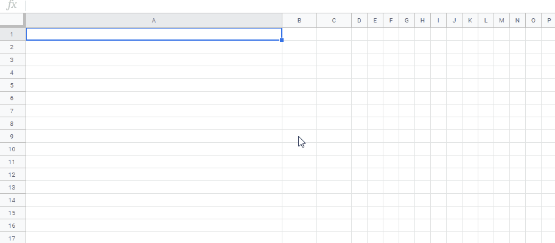

# CopyFolder

<a name="top"></a>

[](LICENCE)

<a name="overview"></a>

# Enhanced Custom Function for Google Spreadsheet using Web Apps as Wrapper

## Overview

**This is a proposal of the enhanced custom function for Google Spreadsheet using Web Apps as the wrapper.**

## Demo



In this demonstration, the following 3 samples are shown.

1. File names are retrieved from the specific folder by the folder name.
2. Values are appended to the sheet.
3. Change the background colors.

<a name="description"></a>

## Description

When the custom function is used, in the current specification, the most methods except several methods (for example, one of them is UrlFetchApp.) that the authorization is required cannot be used. So for example, when the filenames in the folder are retrieved from the folder name, unfortunately, this cannot be directly achieved. When this is tried, an error like `Exception: You do not have permission to call DriveApp.getFoldersByName. Required permissions: (https://www.googleapis.com/auth/drive.readonly || https://www.googleapis.com/auth/drive)` occurs. From this situation, it is considered that when the authorization has already been done, the method that the authorization is required might be able to be used. In this report. I would like to introduce the method for using such methods by using Web Apps as the wrapper.

The flow of this method is as follows.

1. Run the custom function.
2. Request Web Apps using the arguments with UrlFetchApp.

   - The arguments include the function name and arguments for the function.

3. Run the function with the Web Apps, and return the values.
4. Retrieve the returned values from Web Apps and output to the cell.

<a name="usage"></a>

## Usage

Please do the following flow.

### 1. Prepare script.

When your script is used, it becomes as follows. Please copy and paste the following script to the script editor on the container-bound script of Google Spreadsheet.

#### Sample script:

```javascript
const key = "samplekey"; // This is a key for using Web Apps. You can freely modify this.

// Sample function 1.
// This sample script returns the filenames in the folder by giving the folder name.
function getFileNamesFromFolderName(folderName) {
  const files = DriveApp.getFoldersByName(folderName).next().getFiles();
  let ar = [];
  while (files.hasNext()) ar.push(files.next().getName());
  return ar;
}

// Sample function 2.
// This sample script put "values" to "Sheet1" in the active Spreadsheet.
// Sheets API is used.
function putValues(values) {
  if (!Array.isArray(values)) values = [values];
  const id = SpreadsheetApp.getActiveSpreadsheet().getId();
  Sheets.Spreadsheets.Values.append({ values: [values] }, id, "Sheet1", {
    valueInputOption: "USER_ENTERED",
  });
  return "Done";
}

// Sample function 3.
// This sample script set the background colors with the gradation colors.
// Sheets API is used.
function setColors(values) {
  const ss = SpreadsheetApp.getActiveSpreadsheet();
  const step1 = 1 / values[2];
  const step2 = 1 / values[3];
  let rows = [];
  for (let i = 0; i <= 1; i += step1) {
    let cols = [];
    for (let j = 0; j <= 1; j += step2) {
      cols.push({
        userEnteredFormat: { backgroundColor: { red: 1, green: i, blue: j } },
      });
    }
    rows.push({ values: cols });
  }
  const resource = {
    requests: [
      {
        updateCells: {
          range: {
            sheetId: 0,
            startRowIndex: values[0] - 1,
            endRowIndex: values[0] + values[2],
            startColumnIndex: values[1] - 1,
            endColumnIndex: values[1] + values[3],
          },
          rows: rows,
          fields: "userEnteredFormat.backgroundColor",
        },
      },
    ],
  };
  Sheets.Spreadsheets.batchUpdate(resource, ss.getId());
  return "Done";
}

//
// The following script is the script for the enhanced custom function for Google Spreadsheet using Web Apps as the wrapper.
//
// Web Apps using as the wrapper for authorizing.
function doGet(e) {
  let res = "";
  if (e.parameter.key === key) {
    try {
      res = this[e.parameter.name](
        e.parameter.args.includes(",")
          ? e.parameter.args.split(",")
          : e.parameter.args
      );
    } catch (err) {
      res = `Error: ${err.message}`;
    }
  } else {
    res = "Key error.";
  }
  return ContentService.createTextOutput(JSON.stringify({ value: res }));
}

/**
 * Run GAS function.
 * @param {"functionName"} functionName Function name you want to run in this container-bound script.
 * @param {"arg1", "arg2",,,} ...args Arguments for the function.
 * @return Returned values from the function.
 * @customfunction
 */
function RUN(functionName, ...args) {
  const webAppsUrl = "https://script.google.com/macros/s/###/exec"; // Please set the URL of Web Apps after you set the Web Apps.

  if (!functionName) throw new Error("No function name.");
  const url = `${webAppsUrl}?name=${functionName}&args=${args}&key=${key}`;
  const res = UrlFetchApp.fetch(url);
  if (res.getResponseCode() != 200) throw new Error(res.getContentText());
  return JSON.parse(res.getContentText()).value;
}
```

- How to use this custom function is as follows.
  - `=RUN("functionName","arg1","arg2",,,)`
  - `functionName` is the function name in the container-bound script.
  - `arg1` and `arg2` are the arguments for using at the function of `functionName`.
- When this sample script is used, most functions in this container-bound script can be run by the custom function by giving the function name.

### 2. Deploy Web Apps.

1. On the script editor, Open a dialog box by "Publish" -> "Deploy as web app".
2. Select **"Me"** for **"Execute the app as:"**.
   - By this, the script is run as the owner.
3. Select **"Anyone, even anonymous"** for **"Who has access to the app:"**.
   - In this case, no access token is required to be request. But, **in above script, the key is used for accessing to Web Apps**.
4. Click "Deploy" button as new "Project version".
5. Automatically open a dialog box of "Authorization required".
   1. Click "Review Permissions".
   2. Select own account.
   3. Click "Advanced" at "This app isn't verified".
   4. Click "Go to ### project name ###(unsafe)"
   5. Click "Allow" button.
6. Click "OK".
7. Copy the URL of Web Apps. It's like `https://script.google.com/macros/s/###/exec`.

   - **When you modified the Google Apps Script, please redeploy as new version. By this, the modified script is reflected to Web Apps. Please be careful this.**

8. Please set the URL of `https://script.google.com/macros/s/###/exec` to `url` of above script. And please redeploy Web Apps. By this, the latest script is reflected to the Web Apps. So please be careful this.

### 3. Use this script.

#### a. Use "getFileNamesFromFolderName"

Please put the following function to a cell. In this case, `sampleFolder` is the folder name in your Google Drive. By this, the filenames in the folder are returned. As the sample, there are 3 files of "sampleSlides1", "sampleDocument1" and "sampleSpreadsheet1" in the folder of `sampleFolder`.

```
=RUN("getFileNamesFromFolderName","sampleFolder")
```

#### b. Use "putValues"

Please put the following function to a cell. By this, the values of `"sample1", "sample2", "sample3"` are appended to "Sheet1".

```
=RUN("putValues","sample1","sample2","sample3")
```

#### v. Use "setColors"

Please put the following function to a cell. By this, the background colors are changed by the gradation colors. You can see this at above demonstration video.

```
=RUN("setColors",ROW(),COLUMN(),10,15)
```

## IMPORTANT

- In the current stage, the maximum execution time of the custom function is 30 seconds. [Ref](https://developers.google.com/apps-script/guides/services/quotas) Please be careful this.

- When you want to use the scopes you want to use, please set them to the manifest file. [Ref](https://gist.github.com/tanaikech/23ddf599a4155b66f1029978bba8153b)

- When I tested to use the method of appendRow of Spreadsheet service, the process cost was very high. The limitation time (30 seconds) of the custom function was over. When I used Sheets API instead of Spreadsheet service, the process cost could be much reduced. So in the sample script, I used Sheets API. I'm not sure whether this situation is the specification of Google side. I apologize for this.

## References:

- [Custom Functions in Google Sheets](https://developers.google.com/apps-script/guides/sheets/functions)
- [Web Apps](https://developers.google.com/apps-script/guides/web)
- [Taking advantage of Web Apps with Google Apps Script](https://github.com/tanaikech/taking-advantage-of-Web-Apps-with-google-apps-script)

---

<a name="licence"></a>

# Licence

[MIT](LICENCE)

<a name="author"></a>

# Author

[Tanaike](https://tanaikech.github.io/about/)

If you have any questions or comments, feel free to contact me.

<a name="updatehistory"></a>

# Update History

- v1.0.0 (June 8, 2020)

  1. Initial release.

[TOP](#top)
